# 0 A.D. Game Manual

## Table of Contents

1. *Game Objectives and Rules*
2. *User Interface Basics*
3. *Gathering Resources*
4. *Training Units*
5. *Working with Units*
6. *Exploring the Map*
7. *Dynamic Territories*
8. *Technologies and Phases*
9. *Combat*
10. *Trade and Bartering*
11. *License*

## *1. Game Objectives and Rules*

In a nutshell, in **0 A.D.**, you start out with three things:

* **Buildings**, such as civic centers,
* **Units**, such as female citizens and male soldiers, that you can move around the map and use to gather resources, build or fight, and
* Some initial amounts of four **resources**: Food, Wood, Stone and Metal.

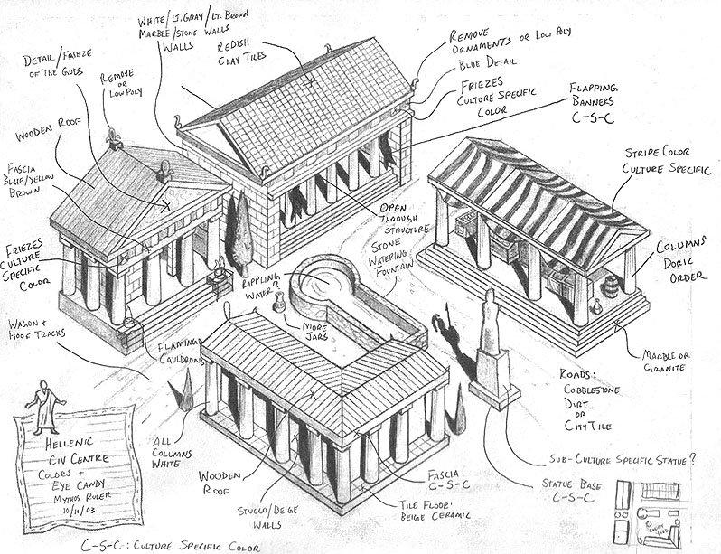

In 0 A.D., you need to gather more of these four resources, and then use them to train (create) various units at your buildings. In turn, you will need to put some of the new units to work gathering more resources and building more types of buildings. In this way, you build a strong economy with a constant income stream of all four resources, and prepare for building a strong military.

As soon as possible, you need to train a large, powerful army, that can even include siege weapons and war ships. Training each of these military units costs the resources you gathered.

Ultimately, you will send off your army to battle in an attempt to destroy all your enemies’ structures that can generate units, and all units that can construct buildings. The first player that achieves this goal, wins.

## *2. User Interface Basics*

The following inputs affect what happens on screen:

* **Selecting objects**: Left-click to select an object, such as a building or a unit. (Notice an outline appears on the ground at the base of the selected object.) You can select many objects at once by dragging the mouse.
 * **Tasks**: If you right-click when a unit is selected, you tell it to do something. If you right-click an empty piece of ground: the unit will move there; right-click an enemy unit: it will attack it; right-click a tree, it will chop it to gather wood, etc.
* **Moving the camera**: Move the mouse towards an edge of the screen to move the camera in that direction and see more of the game world. Also: You can press the arrow keys (or the **w**, **a**, **s** or **d** keys) to move the camera.
* **Rotate map**: Either with Shift + Mouse wheel rotation, or with the **Q** and **E** keys.

## *3. Gathering Resources*

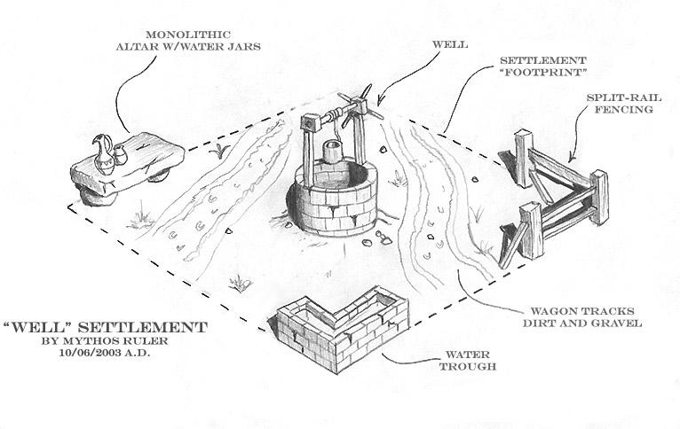

The sum of all resources on the map is limited. These resources can be gathered in several ways:

* **Food**: Foraging from bushes and certain trees; Hunting certain wild animals or slaughtering livestock, such as chickens and sheep; Fishing; Farming.
* **Wood**: Chopping down trees.
* **Stone**: Mining from stone mines.
* **Metal**: Mining from metal mines. (These occasionally sparkle, to make them easier to tell apart from stone mines.)

(On certain maps, you can also quickly gather a great deal of resources from special treasures found on the map, such as shipwrecks.)
Shuttling to Dropsites

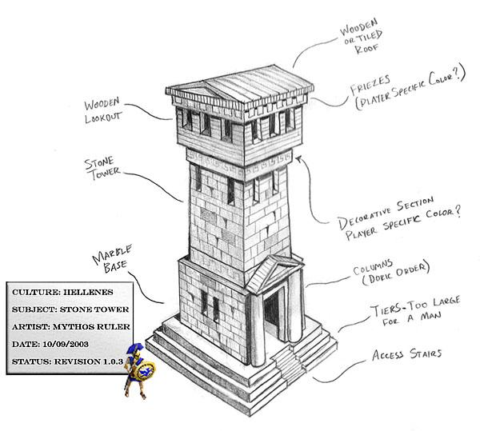

When units gather a resource, there is only so much they can carry. Then they need to shuttle the resources they have gathered to a building that serves as their **resource dropsite** and drop it off there. Only then can they return to gather more resources.

* **Civic centers** and **docks** serve as dropsites for all four resources.
* **Mills** serve as dropsites for wood, stone and metal only.
* **Farmsteads** serve as dropsites for food.

Units automatically shuttle the resources they have been gathering to the nearest dropsite that can accept it. It might be a good idea to build dropsites near their corresponding resources, to make sure your gathering units only have to shuttle short distances, which makes gathering more efficient.

## *4. Training Units*

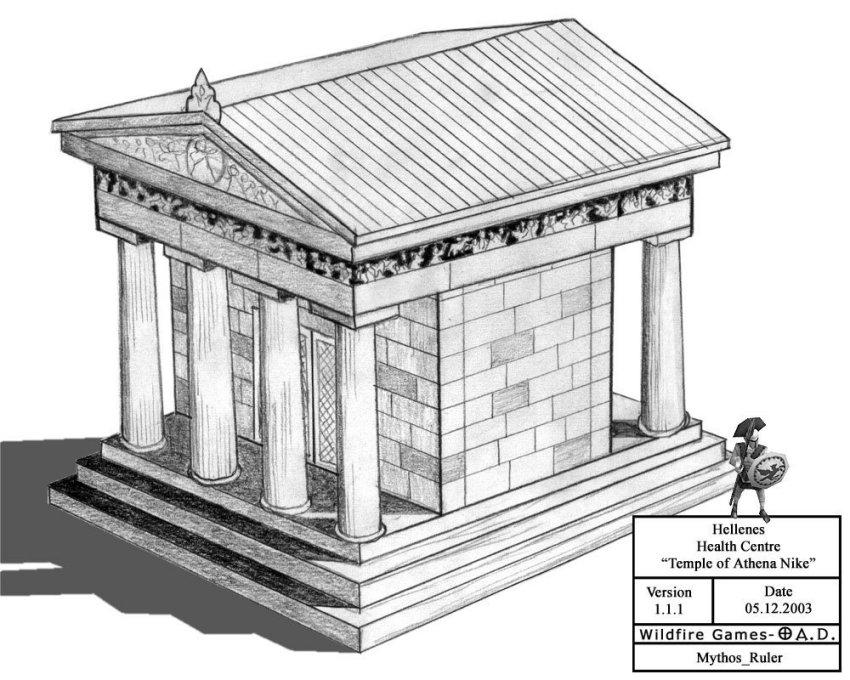

Most buildings in 0 A.D. can train (create) units. If you select a building, you can see in the bottom right panel what types of units can be trained at that building, and how much each type costs.

### Population

Every new unit counts toward your population limit, indicated on the top left of your screen. The limit can be increased, by building more buildings such as houses.

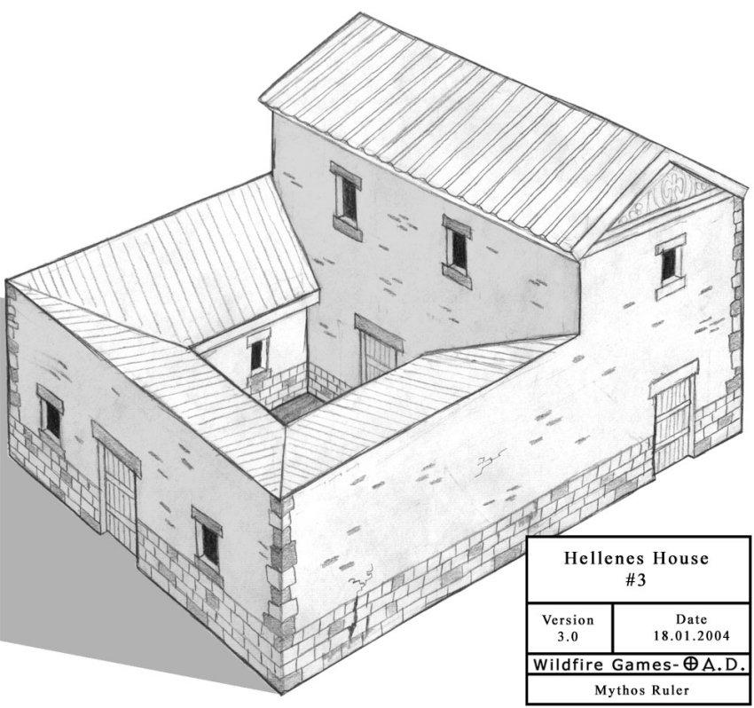

### Rally Points

If you select a building and then right-click a spot on the ground, you will create a **rally point**, which is a destination each new unit created from that building will automatically go to. Rally points can be set on resources, so that units will automatically gather that type of resource when they are created.

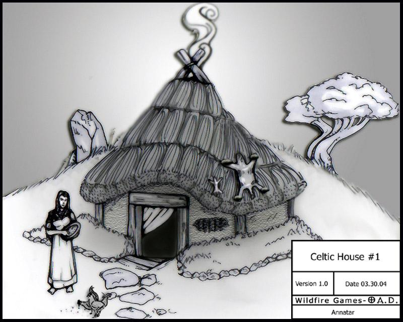

## 5. *Working with Units*

Units in 0 A.D. can be placed on a continuum from “civilian-only”, which are almost exclusively used for accumulating resources, to “military-only”, which can only fight. In the middle, the game features a wide variety of citizen soldiers, which can do a little bit of both.

### Female Citizens

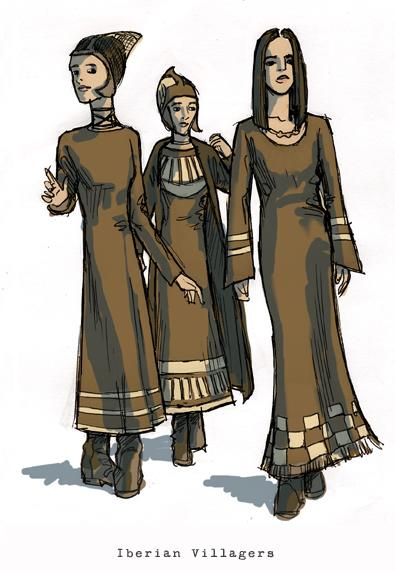

You usually start out a game with a few **female citizens**, who are the driving force of your economy. They specialize in gathering resources, particularly Food, by foraging and farming more efficiently than other units. They can also build civic buildings, such as resource dropsites, and cause nearby male units to work faster. Although they can attack enemy units, they are very vulnerable to practically any other unit.

### Citizen soldiers

Some units have the dual role of both workers and soldiers, meaning they are **citizen soldiers**. For example, hoplites can not only fight but also chop wood. Citizen Soldiers have bonuses for gathering wood, stone and metal. Certain buildings, such as fortresses, can only be built by citizen soldiers.

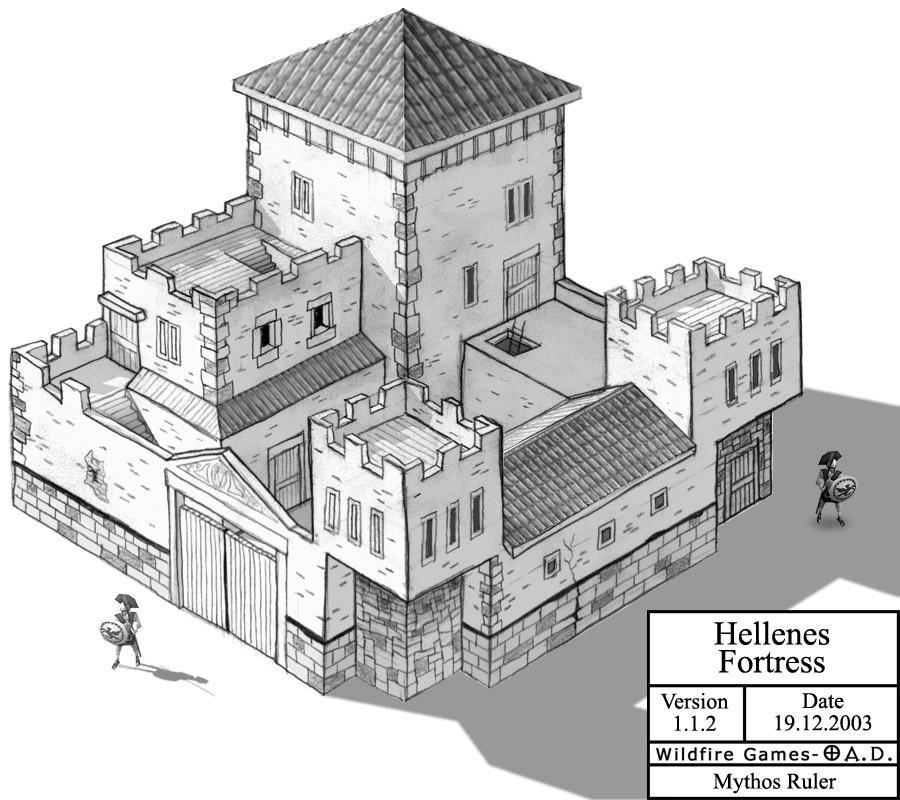

### Ranks

The more citizen soldiers fight, the more battle experience they gain, and automatically go up the ranks. With each **rank**, they become stronger, and don a unique appearance, but also get gradually worse at “civilian” tasks, such as gathering resources.
Champions and Heroes

You may also train **champion units**, which are more expensive than citizen soldiers and cannot do any task but fight, but are stronger and better at fighting. You can also train exactly one hero in a game, which is a very strong unique unit.

## *6. Exploring the Map*

### Shroud of Darkness

You begin with only a small portion of the map revealed to you; The rest is covered in black. This black cover is called the **Shroud of Darkness**, and it may be hiding your enemies’ base, useful resources and more. The shroud is gradually removed and the map is gradually revealed when you send units to explore new parts of the map.

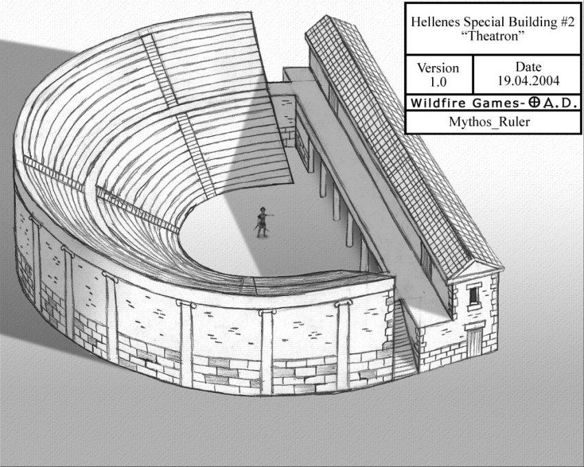

### Fog of War

Areas that you have explored, but currently do not have any units or buildings in them, appear with a grey shading covering them. This is the **Fog of War**. Even if things change on the map, under the Fog of War you you will only see objects as they were when your units or buildings last “saw” them. For example, if trees are cut down or a new enemy building is built under the Fog of War, you won’t see the change unless you send a unit there again. Importantly, enemy units are not seen at all under the Fog of War.

If you have allies, you can see whatever parts of the map your allies have explored and vice versa.

### Gathering Intelligence

When exploring the map, you should be trying to find:

* Treasures,
* Resources,
* Strategic areas on the map, such as river crossings,
* The location of your enemies’ bases,
* How fortified your enemies’ bases are,
* What sort of military units they have been training, and more.

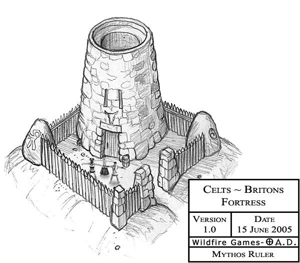

All of this information can help you make the decisions that will make you victorious, such as the best direction to expand your base, and the types of units you should be training to counter your adversary.

## *7. Dynamic Territories*

Most buildings can only be built within your own **territory**, marked by colored borders on the ground. Players can expand their territory by constructing buildings near their borders. (Some types of buildings will expand your territory more than others.) Borders may change throughout the game, based upon the buildings built and destroyed by the players.

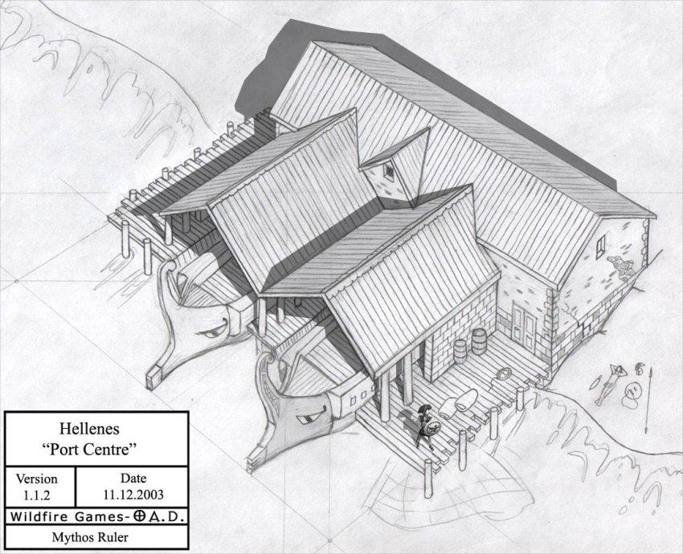

If one of a player’s buildings falls into enemy territory due to shifting borders, then the building will slowly lose loyalty until finally converting to the enemy’s side. This can be stopped and slowly reversed if the border shifts and the building comes back to the player’s side.

### Important Exceptions

There are a few important exceptions to this rule:

* **Outposts**, **Docks** and Roman **Entrenched Army Camps** can be built outside your borders, but none of these will gain you new territory;
* The **Civil Center** can be built either on your territory or on unclaimed territory, but must be built a certain distance away from your existing civil centers. Building a civil center can gain you lots of extra territory. Moreover, as you progress through different phases of the game (see “Technologies and Game Phases”), the territory controlled by your Civic Centers will expand by a small amount.
* Docks do not lose loyalty/health outside your territory, but Outposts and Roman Entrenched Army Camps do. Roman Entrenched Army Camps can also be built in enemy territory.

## *8. Technologies and Phases*

### Technologies

**Technologies**, or techs, are economic or military bonuses that can be “researched” (bought) for resources at designated buildings. Hover over the technology buttons to learn about the costs and benefits of each technology.

In 0 A.D., some technologies come in mutually exclusive pairs: This means that within each pair, you can either research one technology or the other, but not both in the same game. These technology pairs are represented on your screen by a link symbol “connecting” two buttons.

### Phases

0 A.D. describes the progression of a city from humble beginnings to greatness in three phases: the **Village Phase**, the **Town Phase**, and the **City Phase**. When the game starts, you are already in the Village Phase. If you want to progress to the Town and City Phases, you need to research each of these at the Civic Center.

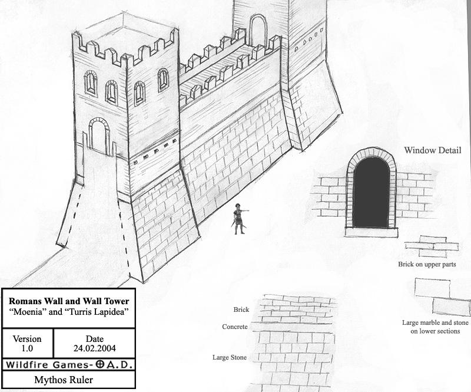

Phases are like technologies, but much more valuable, because by reaching a new phase you unlock many new types of buildings, units and technologies. Researching each phase is not only expensive but also requires you to have constructed certain buildings:

* Advancing to the **Town Phase** costs 500 Food, 500 Wood, and requires having built five buildings of any type, except palisades and farm fields. (Five houses, for example, are sufficient, and so are three houses, a mill and a farmstead.)

* Advancing to the **City Phase** costs 1000 Stone and 1000 Metal, and requires having built four buildings of any type that becomes available in the Town Phase (except Walls and Civ Centers).

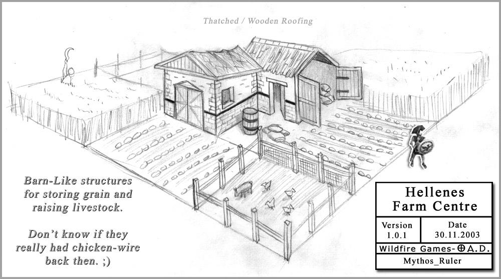

## *9. Combat*

### Types of Combat Units

With a few exceptions, all combat units belong to one of these types:

* **Infantry**: Warriors fighting on foot, with swords, bows and arrows, etc.,
* **Cavalry**: Warriors on horseback,
* **Siege weapons**, such as catapults, and
* **War ships**, such as triremes.

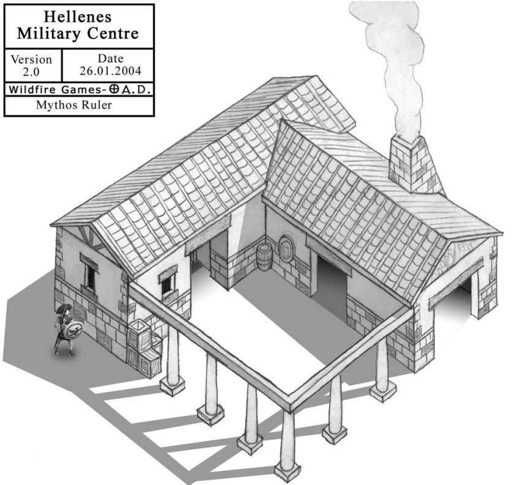

### Melee vs. Ranged Units

Some of the units mentioned here are **melee units**, which can only fight when very close to the enemy (e.g., with a sword); Others are **ranged units**, which shoot or throw a weapon from afar, so they only need to get close enough to be within range (but not too close). Each of these types has its advantages and disadvantages. For example, some ranged units may be very powerful against certain melee units from a distance, but helplessly vulnerable to melee attack from up close.

### Types of Damage and Balancing

Damage in 0 A.D. comes in three types: **hack**, **pierce** and **crush**. Units have different armor for each type. In addition, unit attacks may be of multiple types simultaneously, e.g., a hoplite does both pierce and hack damage.

On top of this, some units have special bonuses against particular other units, e.g., spearmen defeat melee cavalry, but are countered by skirmishers and cavalry archers.

Consider that different units have different movement speeds, firing rates, hit points and costs, and you get a complex game with many strategic choices to make when choosing how to spend your resources. In-game documentation can be found in each unit’s description when hovering above the button to train it.

## *10. Trade and Bartering*

### Trade

**Trading** allows you to gain resources simply by having your traders shuttle between markets or docks. Traders that travel over land can be trained at markets, and merchant ships that sail over sea can be trained at the dock.

(The following explanation refers to both markets and docks; “Market” is used for brevity.)

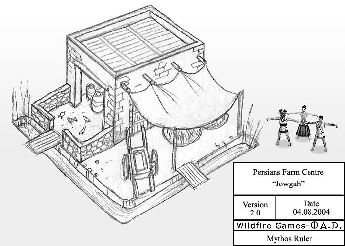

Establish a trade route between two markets by selecting a trader and right-clicking two markets one after another, setting them as “origin” and “destination” markets. Your traders will then start shuttling between them, gaining resources for every round trip made; You can choose which resource will be gained by each trader. The longer time it takes to travel between the two markets, the more of that resource you will get at the end of each round trip.

You can have a trader shuttle between two of your own markets, or between your market and an allied market. The latter case yields more resources per trip than the former.

### Bartering

**Bartering** allows you to buy and sell resources in exchange for other resources at the market. Resources are traded at exchange rates that vary with each deal. For example, to purchase 100 Food, you may initially have to spend 100 points of another resource type (Wood, Stone, or Metal). By the next deal, however, Food will become more expensive. The rates are global, so if another player buys Food it will be more expensive for you as well. Over time, the exchange rate gradually resets to the default rate.

## *11. License*

Content originally written by Jeru, published under the following license: Creative Commons, Attribution-ShareAlike 3.0 Unported, by **Wildfire Games**.

A link to the license is available here: https://creativecommons.org/licenses/by-sa/3.0/