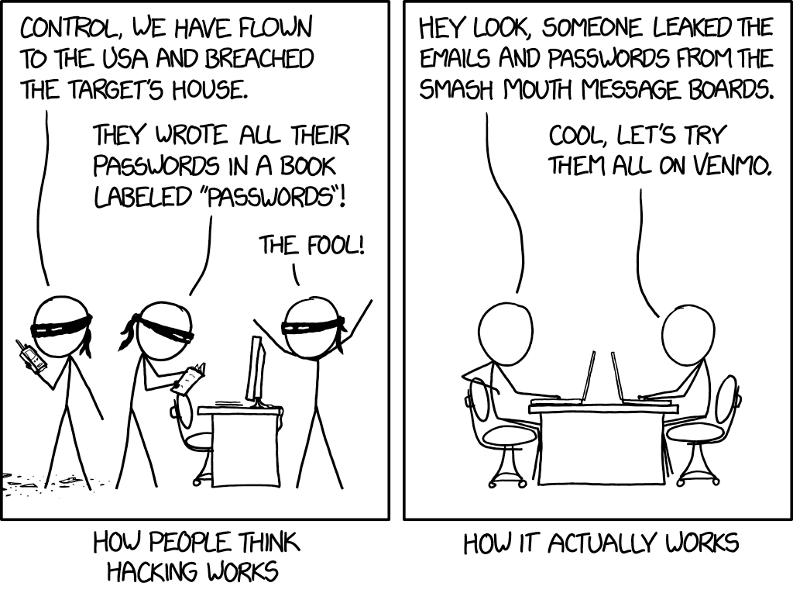
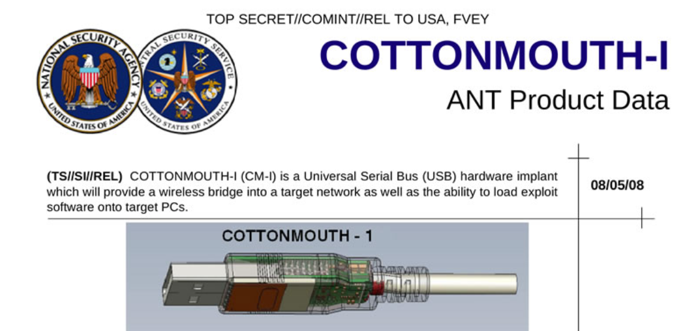
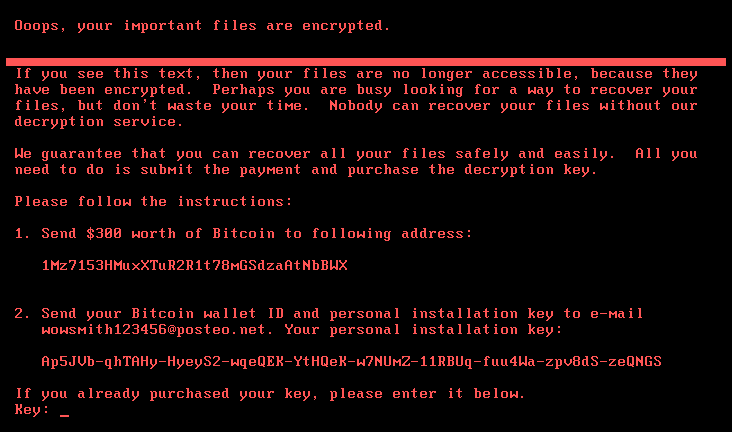
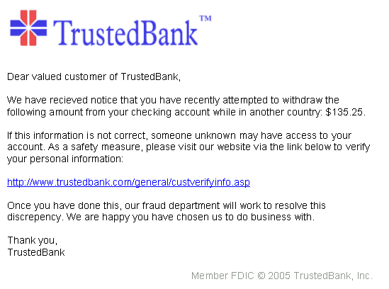
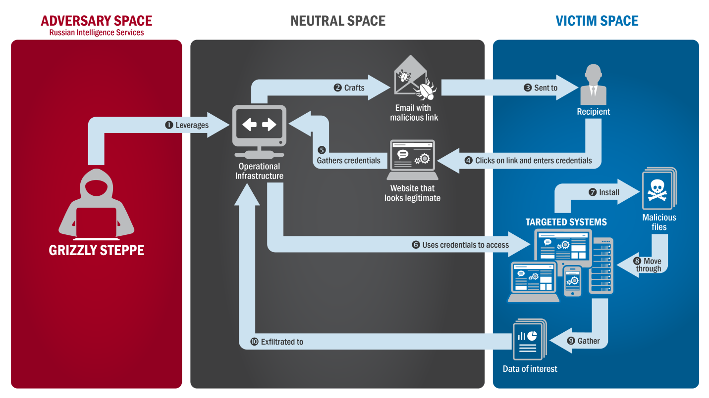

<!-- _paginate:  -->
<!-- _backgroundImage:  -->
<!-- _color: white  -->
<!-- _footer: . -->

## Just Another Cyber Security Awareness Training 

### 2023 Edition, v1.00

---

### *Plan*

1. Introduction
2. Crash course on information security
3. The threat landscape
4. Improve your digital hygiene

---

<!-- _color: white  -->

<!-- _footer: . -->

# 1. Introduction

---

<!-- _backgroundImage:  -->
<!-- _footer: CC BY NC https://xkcd.com/2176/ -->

---

<!-- _header: 1. Introduction -->

## Questions driving this presentation

- *What is information security?*
- *What should I be aware of when it comes to cyber-security threats?* 
- *How can I improve my personal digital hygiene and mitigate cyber-security threats?*

<!--
Who I am?: I am Lukas Greve, from Geneva. During the day, I work for an IT company. During the night, I sleep.
Audience: this training has been designed to be consumed by members of an organization that are not part of the IT department (e.g. project managers; recruiters; communication specialists; etc)
Just like articles in Wikipedia, this presentation is free and open: you are free to copy it, to modify it and to share it
Don't take what is included in this presentation as face value. Exercice your critical judgment. 
-->

---

<!-- _color: white  -->

<!-- _footer: . -->

# 2. Infosec crash course

---

<!-- _header: 2. Infosec crash course -->

## Terminology
- **Information security**: the study of how to maintain the confidentiality,  integrity and availability of digital information 
  - Information security is often abreviated as *infosec*
- [**Holistic security**](https://holistic-security.tacticaltech.org/): blending physical, psycho-social and information security together
  - Concept introduced by the German-based NGO [Tactical Tech](https://tacticaltech.org/) 
- **Encryption**: a process to make a discrete piece of information indecipherable

<!--
In this training, the cyber and information suffixes are used interchangeability (e.g information security and cyber security). Both suffixes refers to what is happening online.

Threats and risks are used interchangeability.

A robust defense exists when risk mitigation tactics are used both online and offline.

In this training, we will focus on information security threats.

- Distinction between digital hygiene in the personnal and corporate setting
-->

---

<!-- _backgroundImage:  -->
<!-- _footer: CC BY NC https://xkcd.com/2176/ -->

---

<!-- _header: 2. Infosec crash course -->

## Observations

- Information OR security 
  - Information security is a process not an end state 
  - There is always a non-zero risk
- Information that doesn't exist as bits of data does not need to be secured
  - See also [*Data Is a Toxic Asset*](https://www.schneier.com/blog/archives/2016/03/data_is_a_toxic.html)

---

<!-- _color: white  -->

<!-- _footer: . -->

# 3. The threat landscape

---

<!-- _header: 3. The threat landscape -->

## Cyber Powers: a ranking

| Rank |        2020 |        2022 |
| -:   | -: | -: |
| 1    |          US |          US |
| 2    |       China |       China |
| 3    |          UK |      Russia |
| 4    |      Russia |          UK |
| 5    | Netherlands |   Australia |
| 6    |      France | Netherlands |
| 7    |     Germany | South Korea |
| 8    |      Canada |     Vietnam |
| 9    |       Japan |      France |
| 10   |   Australia |        Iran |
| 11   |      Israel |     Germany |
| 12   |       Spain | **Ukraine** |

<!--
Ukraine from number 25 in 2020 to number 12 in 2022
-->

---

<!-- _header: 3. The threat landscape -->

### Russia's Advanced Persistent Threats (APTs) actors

| Name |        Affilation | Known for |
| ---- | ----------: | ----------: |
| [Sandworm](https://en.wikipedia.org/wiki/Sandworm_(hacker_group)) or Voodoo Bear | GRU | [NotPetya](https://en.wikipedia.org/wiki/Petya_and_NotPetya), 2017 cyber attack on Ukraine |
| [Fancy Bear](https://en.wikipedia.org/wiki/Fancy_Bear) or APT28 | GRU | US elections medling |
| [Cozy Bear](https://en.wikipedia.org/wiki/Cozy_Bear), or APT29 | SVR or FSB | US elections medling  |

$$Cozy Bear +Fancy Bear= Grizzle Steppe
$$

<!--
APTs operating in the West are lesser known, and less studied. The Equation Group is believed to be associated to the NSA.

Fancy Bear + Cozy Bear = Grizzly Steppe

Other examples: black hat hackers
-->

---

<!-- _header: 3. The threat landscape -->

## Part of NSA's toolkit in 2009

- Now [available online](https://shop.hak5.org/products/omg-cable) for less than 200$ (in 2023)

<!--

-->

---

<!-- _header: 3. The threat landscape -->

## Origin of security-related threats and their frequency

|  | Group impact | Individual impact |
| --- | --- | --- |
| Rare | *APTs* | *N/A* |
| Common | *Criminal groups* | *User mistakes or errors* |

<!--
Can you think of a user error with security implication? (e.g. leave computer unlocked and unattended)
-->

---

<!-- _header: 3. The threat landscape -->

## Attack vectors

| **Threats**    |Advanced                                                                                                                                                                                                                                                                                                                                                                 | Simple                                                                                            |
| -------------- | ------------------------------------------------------------------------------------------------------------------------------------------------------------------------------------------------------------------------------------------------------------------------------------------------------------------------------------------------------------------------ | ------------------------------------------------------------------------------------------------- |
| *Targeted*     | E.g. Zero-click remote exploits (i.e [Pegasus spyware](https://en.wikipedia.org/wiki/Pegasus_%28spyware%29)); coordinated [smear campaigns](https://en.wikipedia.org/wiki/Smear_campaign#:~:text=A%20smear%20campaign%2C%20also%20referred,applied%20to%20individuals%20or%20groups.) fueled by a [Troll farm](https://en.wikipedia.org/wiki/Troll_farm) | E.g. [Spear phishing](https://en.wikipedia.org/wiki/Phishing)                                     |
| *Non-targeted* | E.g. [Ransomware](https://en.wikipedia.org/wiki/Ransomware) attacks                                                                                                                                                                                                                                                                                                      | E.g. Generic phishing email or [Advance-fee](https://en.wikipedia.org/wiki/Advance-fee_scam) scam |

<!--
As time passes, what was considered an advanced threat is becoming a simple one (e.g. ransomware as a service)

One could add one temporal dimension, differentiating between persisting and transient threat. See for instance APTs.

See the ANT Catalog https://en.wikipedia.org/wiki/ANT_catalog
-->

---

<!-- _header: 3. The threat landscape -->

## Petya ransomware message

<!--

-->

---

<!-- _color: white  -->

<!-- _footer: . -->

# 4. Improve your digital hygiene

---

<!-- _header: 4. Improve your digital hygiene -->

## Phishing email: sanity checks

| Checks |  | Action |
| --- | --- | --- |
| *Does it ask you to act **quickly** to execute a **sensitive** operation?* | :white_check_mark: | **Contact the person directly to verify, using another means of communication. Report to IT if a spam** |
| *Is it **poorly** written?* | :white_check_mark: | **Common mistakes might be indicative of a scam. Contact the sender and report it to IT if needed**  |
| *Has it been sent using the domain name of the company associated to the sender?* | :x: |  **If not, it most likely a scam. Report it to IT**  |
| *If the message asks you to login or reset your password, can you be sure that **you initiated the request?*** |  :x:   |  **If not, it is most likely a phishing attempt. Report it to IT** |

<!--

-->

---

<!-- _header: 4. Improve your digital hygiene -->

## Phishing email example

<!--

- It is poorly written
- It asks yo to verify your personal information.
- The domain name seems legitimate, but the underlining link probably is not
- What should you do? Contact your bank directly

-->

---

<!-- _header: 4. Improve your digital hygiene -->

## Beware of links

- *Please log in here*:
   - [https://en.privatbank.ua/](https://en.wikipedia.org/wiki/Rickrolling)

<!--

- It is poorly written
- It asks yo to verify your personal information.
- The domain name seems legitimate, but the underlining link probably is not
- What should you do? Contact your bank directly

-->

---

<!-- _header: 4. Improve your digital hygiene -->

## Surf safely online

- **Separate your professional life from your personal one**
  - Don't log on to personal accounts on your company laptop 
  - If you do need to do so, use [the private browser mode](https://en.wikipedia.org/wiki/Private_browsing)
- **Your browser is one of the main vectors for attacks: protect it**
  - Targeted ads may be used for nefarious purposes
    - Use an ad blocker (e.g. *[uBlock Origin](https://ublockorigin.com/)*) if allowed by your company policy
  - If you have a company-provided password manager, don't let your browser store your passwords
  - Only browse on known and previously vetted websites
- **Restrict access to your online accounts**
  - Use [second-factor authentication](https://en.wikipedia.org/wiki/Multi-factor_authentication) (2FA) whenever available

<!--

-->

---

<!-- _color: white  -->
<!-- _footer: . -->
<!-- _backgroundImage:  -->
<!-- _footer: CC BY NC https://xkcd.com/936/ -->

---

<!-- _header: 4. Improve your digital hygiene -->

### How to share information online

#### *Protect data in transit*

- Avoid sharing very sensitive information online. If you need to do so, **use E2EE**
  - Emails are rarely end-to-end encrypted (E2EE)
  - Most real-time messaging applications do not use E2EE
  - Mobile applications such as WhatsApp or Signal use E2EE
- Use HTTPS and your corporate VPN

<!--

- https://www.wikipedia.org/

-->

---

<!-- _header: 4. Improve your digital hygiene -->

### Use file-based or full-disk encryption

#### *Protect data at rest*

- Any device that is storing personal or corporate data ought to be encrypted
  - Is the device that you are using encrypted?
    - For Windows, browse [here](https://support.microsoft.com/en-us/windows/device-encryption-in-windows-ad5dcf4b-dbe0-2331-228f-7925c2a3012d)
      - [Turn on](https://support.microsoft.com/en-us/windows/turn-on-device-encryption-0c453637-bc88-5f74-5105-741561aae838#ID0EBD=Windows_11) device encryption on Windows
    - For macOS, browse [here](https://support.apple.com/guide/mac-help/protect-your-mac-information-with-encryption-mh40593/mac)
    - iOS enables encryption by default. More information [here](https://support.apple.com/guide/security/encryption-and-data-protection-overview-sece3bee0835/1/web/1)
    - Android supports [file-based encryption](https://source.android.com/docs/security/features/encryption/file-based)

---

<!-- _footer: . -->

---

<!-- _header: 4. Improve your digital hygiene -->

### Your mobile device: **a to-do list**

| Action | Difficulty | Done? |
| - | - | - |
| Set screen lock | Simple [(Android](https://support.google.com/android/answer/9079129?hl=en) or [iOS](https://support.apple.com/guide/iphone/set-a-passcode-iph14a867ae/ios)) | | 
| Disable or uninstall all unwanted applications | Simple [(Android](https://support.google.com/googleplay/answer/2521768?sjid=16793289067014238037-EU&visit_id=638298546282253582-125195042&rd=1) or [iOS](https://support.apple.com/guide/iphone/remove-apps-iph248b543ca/ios)) to moderate | |
| Don't delay updates. Update your phone when updates are available | Simple [(Android](https://support.google.com/android/answer/7680439?hl=en) or [iOS](https://support.apple.com/en-us/HT204204))| |
| Encrypt your phone storage and SD card (if applicable) | Simple | |
| Use a browser like Firefox, compatible with uBlock Origin | Simple to Moderate | |
| Use a your smartphone to generate one-time passwords | [Moderate](https://support.microsoft.com/en-us/account-billing/download-and-install-the-microsoft-authenticator-app-351498fc-850a-45da-b7b6-27e523b8702a) | |
| Don't use a smartphone | Impossible? | |

---

<!-- _header: 4. Improve your digital hygiene -->

### Your laptop: **a to-do list**

| Action | Difficulty | Done? |
| - | - | - |
| Disable or uninstall all unwanted applications | Simple to moderate ([Windows 11 or 10](https://support.microsoft.com/en-us/windows/uninstall-or-remove-apps-and-programs-in-windows-4b55f974-2cc6-2d2b-d092-5905080eaf98))  | |
| Don't delay updates. Update your computer when updates are available | Simple [(Windows 11 or 10)](https://support.google.com/android/answer/9079129?hl=en) | | 
| Check if encryption is enable. If not enable, contact IT | Simple [(Windows 11 or 10)](https://support.microsoft.com/en-us/windows/device-encryption-in-windows-ad5dcf4b-dbe0-2331-228f-7925c2a3012d) | | 
| Set a browser as the default application | Simple to almost impossible [Windows 10 or 11](https://support.microsoft.com/en-us/windows/change-default-programs-in-windows-e5d82cad-17d1-c53b-3505-f10a32e1894d#ID0EDD=Windows_11) | |

---

## Sources

- [Diagram](https://en.wikipedia.org/wiki/Fancy_Bear#/media/File:APT28_APT29_Techniques_-_Malware.png) showing Grizzly Steppe's (Fancy Bear and Cozy Bear) process of employing spear phishing
- Petya [screenshot](https://commons.wikimedia.org/wiki/File:Petya.Random.png)
- Various comics by [xkcd](https://xkcd.com/)
- [National Cyber Power Index 2020](https://www.belfercenter.org/publication/national-cyber-power-index-2020) & [National Cyber Power Index 2022](https://www.belfercenter.org/publication/national-cyber-power-index-2022) by Belfer Center for Science and International Affairs, Harvard Kennedy School

---

## Resources

| Type | Name and URL | Description |
| - | :-: | -: |
| Resources | https://privacytools.is | “Privacy Tools” is a website that provides a list of tools and privacy-oriented services |
| Resources | https://prism-break.org | "Prism Break” is a website that provides a list of tools and privacy-oriented services |
| Mobile software | https://f-droid.org | F-droid provides an alternative to Google Store for Android phones |
| ONG | [The Privacy Lab](https://privacylab.yale.edu/)|  Privacy laboratory attached to the Yale university |
| ONG | [CyberPeace Institute](https://cyberpeaceinstitute.org/) | The CyberPeace Institute is a Geneva-based organization protecting the most vulnerable in cyberspace |

---

## Contact

Lukas Greve: please@refre.ch