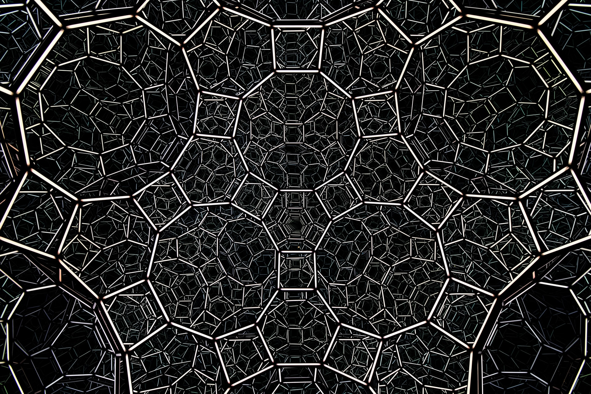

<!-- _paginate: -->

## Qube OS
### Un OS orientée sécurité

<!-- _backgroundImage:  -->
<!-- _color: white  -->
<!-- _paginate: -->

---

### *Au menu*

1. *Introduction*
2. *La sécurité de l'info deux maux (sic)*
3. *Démonstration*

---

## Qubes OS?

Qube OS est un système d'exploitation ouvert et libre qui scelle l'information générée par chaque application dans des silos étanches.

* Ces silos étanches sont appelés **domaines** ou Qubes
* Ces domaines sont associés à **des niveaux de confiance**

Première version sortie en 2012. Créé par Joanna Rutkowska et Rafal Wojtczuk, du Invisible Things Lab, en Pologne.

Plus d'information: **https://www.qubes-os.org/**

---

## Quelques notions autours de la sécurité
- **Sécurité de l'information**: confidentialité, intégrité et disponibilité de l'information (CIA Triad)
- **Sécurité holistique**: sécurité physique, opérationnelle et informatique
- **Sécurité par l'obscurité**: *cacher pour protéger*
- **Sécurité par l'ouverture**: *soumettre à la lumière pour renforcer*
- **Sécurité par l'isolation**: *isoler pour préserver*

---

### Comparaison avec d'autres systèmes d'exploitation

|                          | Windows NT et macOS | Windows NT (Hyper-V) |       QubeOS (Xen) |
| ------------------------ | ------------------: | -------------------: | -----------------: |
| Sécurité par l'obscurité |  :white_check_mark: |   :white_check_mark: |                :x: |
| Sécurité par l'ouverture |                 :x: |                  :x: | :white_check_mark: |
| Sécurité par l'isolation |                 :x: |   :white_check_mark: | :white_check_mark: |

---

Sécurité par l'ouverture +
Sécurité par l'isolation  =
QubeOS

---

---

## Demo time!

---

Acknowledgements:
* Diagram courtesy of the Qubes OS Project website (© 2022 The Qubes OS Project and others)