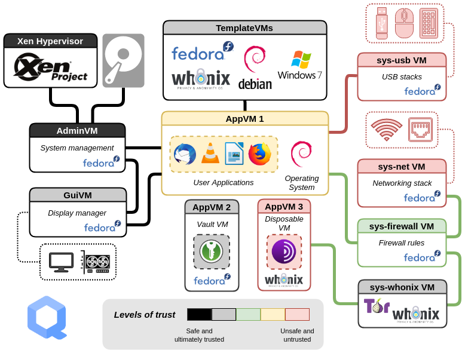

<!-- _paginate: -->

## Qube OS : système orienté sécurité

<!-- _backgroundImage:  -->
<!-- _color: white  -->
<!-- _paginate: -->

---

### *Au menu*

1. *Introduction*
2. *Démonstration*

---

## Quelques notions
- **Sécurité de l'information**: confidentialité, intégrité et disponibilité de l'information (CIA Triad)
- **Sécurité holistique**: sécurité physique, opérationnelle et informatique
- **Sécurité par l'obscurité**: *cacher pour protéger*
- **Sécurité par l'ouverture**: *soumettre à la lumière pour renforcer*
- **Sécurité par l'isolation**: *isoler pour préserver*

---

## Qube OS

* Sécurité par l'ouverture
  * *Logiciel ouvert et libre*
* Sécurité par l'isolation

---

## Qubes OS?

Qube OS est un système d'exploitation qui scelle l'information générée par chaque application ou groupes d'applications dans des silos étanches les uns des autres.

* Ces silos étanches sont appelés **domaines** ou Qube.
* Ces domaines sont associés à **des niveaux de confiance**.

La première version de ce système d'exploitation créé par Joanna Rutkowska et Rafal Wojtczuk, du Invisible Things Lab est sortie en 2012.

---

---

## That's all folks: thank you for your attention!

Let me know if you have any questions

* Lukas Greve
* :envelope: please@refre.ch

*Made with :heart: and free software. [Hack](https://github.com/luzeal/publications/blob/master/virtualization.md) this presentation now!*
